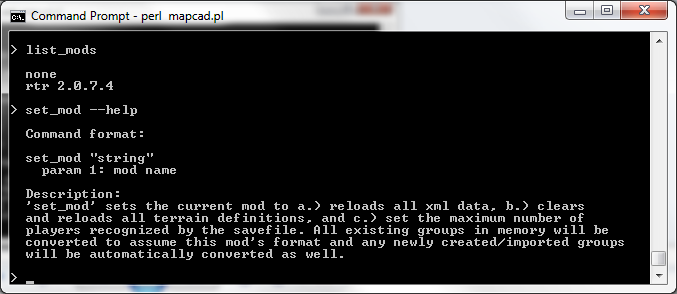
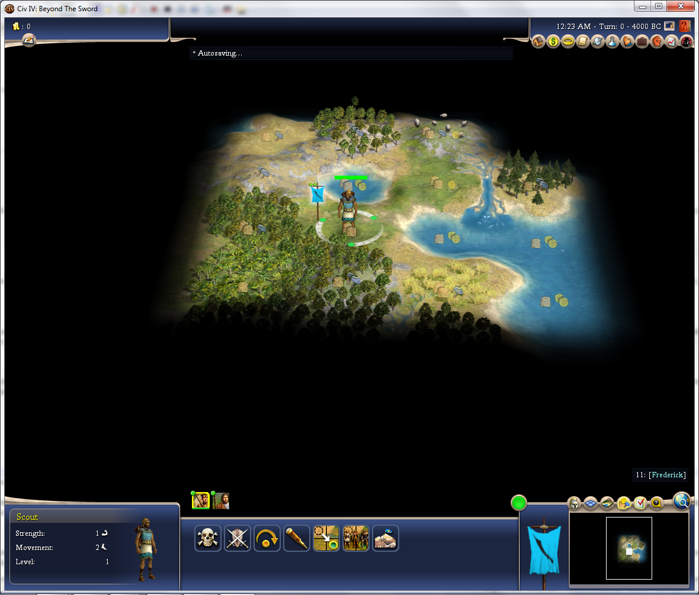

In this tutorial, I'll show you how to get the program running, how to run some basic commands, use the help and debugging interfaces, and finally how to generate starting sims for players in a new pitboss game.

The first thing you'll need to do is install Perl. You can get it here, free:

[http://www.activestate.com/activeperl](http://www.activestate.com/activeperl)

Next, download Civ4 Map Cad from Github by clicking the "Download ZIP" button on the right side of the page. Extract this to a folder somewhere; I put mine in my Documents folder(C:\Users\GermanJoey\Documents\civ4 mapcad) so that it's conveniently nearby my Civ4 saves directory.

Anyways, now we're ready to go! Double click mapcad.pl (or run it as "perl mapcad.pl" from the command line) and you should see a command prompt like this:

and enter the following line to load the tutorial map. "import_group" is the name of the command, "tutorials/t1/tutorial1.CivBeyondSwordWBSave" is a string containing the path, and the "=> $tutorial1" part says that the result of the command will be stored as the object named "$tutorial1". (it'd be kinda like assigning the result of a function to a variable, if this were a programming language)

    > import_group "tutorials/t1/tutorial1.CivBeyondSwordWBSave" => $tutorial1

And you'll see:

Oh no! Not off to a great start! I haven't even explained what this freaking command does and yet it's already giving some kind of error! (A little secret: I set up the save file to give an error on purpose )

It looks like we got an error because this was an RtR mod save, which allows up to 40 players per game. Unfortunately, by default, Civ4MC is set to read standard BTS, which allows only 18 players per game. While the tool will continue to work just fine for now, we'll want our game to run RtR mod, and thus our output files should be RtR format. So, let's try to fix that. But how? First, let's see if there's any commands related to mods:

    > help

Cripes, that's a lot of commands! Lets filter this list; both the "help" command and the all the various "list" commands allow you to filter the list with any string.

    > help mod

Two commands were found that have "mod" in their name, one of which, "set mod," sounds like it'll do what we want. But how do we use it? We could check the command documentation, but all commands also allow you to specify --help to bring up usage info.

    > set_mod --help

This sounds good. We can set our mod to RtR very easily; as soon as we switch mod, all map-type objects are automatically converted. (Windows users can press up or down on their keyboards to cycle through commands, by the way).

    > set_mod "RtR"
    

Alright, cool. Our map is now an object that we can manipulate with other commands. Specifically, it is a "Group" type object, short for "Group of Layers." Don't worry what that means right now, just know that this object contains all the tiles in our map. We'll talk more about groups, layers, and the other object types in the second tutorial. For now, let's just take a look at our map with the "dump_group" command:

    > dump_group $tutorial1

Nothing happened, huh? Civ4 MC doesn't have a gui of its own, but there's still two other guis we can use - the Map Editor for Civ4 Beyond the Sword, and your handy internet browser. In this case, dump_group generates an html file that you can look at as a webpage. Go back to your Civ4 Map Cad directory and drag the "dump.html" file into your browser. You should see something like this:

It's our map in handy html form! You can drop this file in your dropbox and link to it in a lurker thread, and now suddenly the 90% of posters who spend 90% of their internet browsing time while they are at work can look over your map too. Mousing-over each tile will pop up a little tooltip with coordinate and tile information. We can also look at the starts seperately. Try:

    > extract_starts $tutorial1
    > dump_group $tutorial1

Refresh the page, and you should see: 

Each player's starting BFC was extracted as its own layer, and each layer is displayed as its own tab! Neat!
    
At any rate, observant readers might notice that this was actually the map used for PB15. So, this is a finished map and there's not much to do with it. However, if we could travel back in time, we could use the export_sims command, which is similar to the extract_starts command but a lot more useful on a finished map:

    > export_sims $t1
    
In the outputs directory, we'll see that we have a new copy of our map, now converted to the RtR mod (we also could have immediately used "export_group" to do this after using set_mod), but we also have all these other files labeled "start". What are they? Well, copy the tutorial1.start0.CivBeyondSwordWBSave into your beyond the sword/Saves/WorldBuilder directory, load up Civ4 and the latest version of RtR, and choose tutorial1.start0 via Single Player > Play a Scenerio menu option. What you'll see is:

It's a little starting sim of the player 0's BFC, using the correct map settings and difficulty! Mapmakers could hand these out at the start of a new game to save players some busywork at the start of their new games. Note that all hidden resources are stripped, and an AI is crammed into the corner on that little 1-tile island to prevent an auto-victory, and all victory conditions are disabled.

Anyways, that's all for now. In the next tutorial, we'll talk a little bit more about object types and what they mean to the map.

[Back to tutorial index](Readme.md)