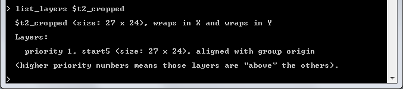

## Regarding Groups and Layers

In this tutorial, we'll talk a little bit more about Layers and Groups of Layers (called "Groups" for short), something we touched on briefly in the previous tutorial.

Most of you will already be familiar with Layer-based designs from using image editors like Photoshop or The Gimp. If not, the essential idea is that we compose an image with multiple images that sit on top of each other. The layers on top cover up layers on the bottom, but these top layers might be smaller or have holes cut in them that allow you see the layers underneath. Other than visibility, the layers don't interact in any other way; they might as well be completely seperate images.

Layer-based design is very handy because it allows us to seperate and modify parts of a complex composition one at a time without disturbing the other parts. For example, consider a continents-style map in Civ4. We might have two continents exactly like we want them, but unfortunately they're spread 8 tiles apart and only accessible at Optics. We'd like to move them next to each other so that a galley can sail from one to the other. If we tried to move one of the continents exactly by hand in the Worldbuilder, the task would take many hours because hundreds of tiles need to be moved one at a time. Alternately, we could add some land between the continents. But, hrmmm, now the civs closer to the new land we added have extra space, so we'll need to move their starts, but now the distance to copper/horses/iron is different, and... and, sooner than later, everything gets messed up. Wouldn't it be great if these continents were on their own layer, and could just be moved as one big chunk?

Astute readers might notice a problem at this point. "Photoshop and other image editors can do layers because they have transparent pixels, but Civ4 has nothing like that." That's true, so we have to cheat a bit by making ocean and coast tiles without resources our transparent tiles if they're on an upper layer. To help with this, we transform all coast tiles into ocean tiles when a map is imported into Civ4MC, and then set coast properly around landmasses when a map is exported back out.

So, in Civ4MC, a layer is just a map snippet, while a Group is a bunch of layers packaged together and sitting on top of one another. For the most part, just like Photoshop layers, the layers of a Group object are independent entities that only interact when the final group is flattened for export. Unlike photoshop images, however, Civ4 maps wrap. So, we do have a little bit more interaction between our layers here - wrap will be the same for all layers in a group.

Here's a full list of how Groups and Layers depend on each other:

* The widths/heights of a group and its layers are independent.
* However, when a layer is added to a group, the group will expand its dimensions to accomodate it if the layer is bigger.
* A group and its layers all have the same wrap properties; if the group wraps in the X direction, so will all of its layers.
* When a layer is first added to a group, its 0,0 coordinate will align with the 0,0 coordinate of the group. (the bottom right) The 'move_layer' command can then be used to move the layer around.

Not too complicated, right? Let's see an example, using the same map as the last tutorial. Run these commands:

    set_mod "2.0.7.4"
    import_group "tutorials/t1/tutorial1.CivBeyondSwordWBSave" => $tutorial2
    debug_group $tutorial2 --add_to_existing
    
## Manipulating Groups and Layers
    
But, you know what? This map is way bigger than necessary for an example; let's trim it up a bit using the **crop_group** command. (Remember that you can use '--help' on any command to learn more about it!)

I think from about here to here should be good:

Now to run these commands, and Voila!
    
    crop_group --help
    crop_group $tutorial2 12 0 38 23 => $t2_cropped
    debug_group $t2_cropped --add_to_existing
    

    
Alright, so we have our main object for this lesson, $t2_cropped. It is a group, and it has only one layer. Note that both groups we've created, $tutorial2 and $t2_cropped, both still exist as far as Civ4MC is concerned. We can take a look at them with the 'list_groups' command:

    
Probably about what you'd expect, right? There's a few different list commands, for various types of objects (e.g. list_groups, list_shapes, list_weights, etc), and, like the **help** command, we can filter them out with a search. For example, "list_groups $tutorial2" would list just the $tutorial2 group. Big whoop, right? Try **list_terrain** and you'll see that filtering is a lot more useful there. :)

Anyways, let's make this group a little more interesting by extracting each of the BFCs into their own layers with the **extract_starts** command. This is similar to the **export_sims** command that we used in the last tutorial, but rather than packaging up each starting capital BFC nicely with a bow and dummy AI, we just cut each of them out with scissors and move them to their own layer. So run:

    extract_starts --help
    extract_starts $t2_cropped
    debug_group $t2_cropped --add_to_existing
    
And we'll see... yikes! Our little happy guys have drowned!

Don't worry, they're still there. Take a look at the new tabs:

The **list_layers** command sheds some light on the matter:

Our four remaining BFCs still left after the crop, the starts for players 1, 3, 4, and 5, have been punched out of the background, the layer called "tutorial2," (so named because we originally imported this map via the **import_group** command into a group named $tutorial2) and moved to their own layers above it.  Thus, the situation looks something like this:

We're now free to manipulate the layers as we see fit. Let's mess with player 3 and player 4 a bit, by flipping their starts horizontally and vertically... JUST BECAUSE WE CAN. ;) We'll use the **flip_layer_tb** and **flip_layer_lr** commands. For commands that take a layer as a parameter, you can refer to a group's layers individually by using a "." similar to how many programming languages do OO.

    flip_layer_tb $t2_cropped.start3
    flip_layer_tb $t2_cropped.start4
    flip_layer_lr $t2_cropped.start3
    flip_layer_lr $t2_cropped.start4
    
Finally, we'll flatten $t2_cropped back into a single layer and export the map.

    flatten_group $t2_cropped
    export_group $t2_cropped
    debug_group $t2_cropped --add_to_existing
    list_layers $t2_cropped
    
As you can see, everything's back to how it was except that player 3 and 4's starts are flipped. You can drag the "start 3" tab next to the final output (whose single layer is called "start_5" because the "start 5" layer was on top) for easy comparison.

That's it for this one. In the next tutorial, we'll see how to generate maps from scratch using Masks, Shapes, and Weights.

[Back to tutorial index](Readme.md)