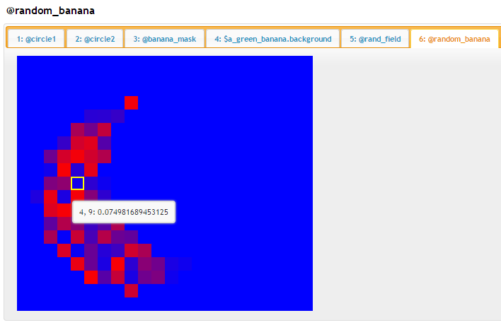
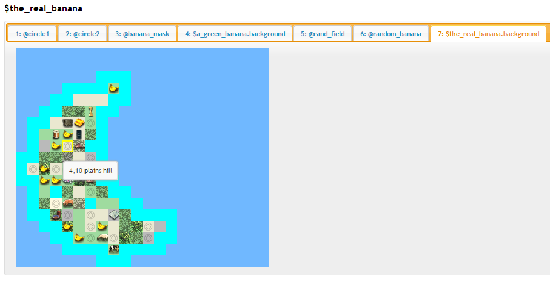

Ah, after relaxing with a quiet evening spent playing your pitboss turns, you settle into bed with expectations of blissful dreams of your glorious empire. The drama and tension of the game... it all begins to fades away, just as you notice that something seems amiss. You stir... and suddenly, flames erupt in a ring around your room! A gaunt, disheveled stranger with eyes of coal materializes before you. Materializes? Huh? Or was he always there...? Your mouth agape, you leap back, knocking your head against the wall. You stir... "Is this h-hell...?", you manage to whisper. Oh, perhaps, perhaps, he smirks with a low growl. At least, it is if these guys have anything to do with it. Out of your closest pop five men in raggeddy banana suits... and they begin to dance. Oh, you feel the true horror now, as it begins to down on you what's really going on here... that's right, it's the original members of [TEAM BANANA](http://www.garath.net/Sullla/Civ4/ADG12.html) from the infamous Apolyton Demogame... and they want YOU to make a map for their reunion game!!

       

Obviously, these fools will insist on a banana map, and they ain't lettin' you leave this place until you give it to them. Surely, this will be the worst thing you've ever been apart of - and Donovan Zoi isn't gonna come heroically swooping to the rescue this time. But hold on tight, I'll help you get through it.

Ok, the first thing we'll need to do is figure out how draw a banana. We'll need one banana island per player at the very least. We could just click this out in the worldbuilder and import it with *import_group*, but where's the fun in that? Besides, it might be the case that we need to make some changes later, so instead let's try creating one using Civ4 MC's special terrain generation tools: Masks, Weights, and Shapes.

Before we continue, let me explain what these things are and what they do. The first, Masks, are kind of like a stencil that sits on top of the map. The mask is essentially a 2d plane, just like a map, and can be of any size. Instead of tiles, a mask is made up of values between "1" and "0". Thinking about the most simple case, where values are *only* 1 and 0, a Mask is like a cookie cutter. The cookie dough is the background, and the shape of the cutter itself (if it were solid inside) would be a bunch of 1's.

If we think of it like ascii art, it might look like this, where the '*' have a value of 1.0 and the blank spaces have a value of 0.0:

             ***     
            *****    
             ***     
         *********** 
          *********  
            *****    
           *******   
          **** ****  
         ****   ****  

Civ4 MC has a way to turn ascii art like this directly into a mask object. We just need to put it into a file and then load it with the *import_mask_from_ascii* command. Unfortunately, a gingerbread man won't help us make a banana... we need something else. Now, we could just make a big banana ascii art (using an image-to-ascii service (e.g. [http://www.text-image.com/convert/](http://www.text-image.com/convert/)) and the *cleanup_ascii* command might help here) but instead we're going to do things in a little bit more fancy of a way to show off some other Civ4 MC commands.

First, let's import a circle ascii art. Our circle looks like this:
                 
            *        
         *******     
        *********    
       ***********   
      *************  
      *************  
      *************  
     *************** 
      *************  
      *************  
      *************  
       ***********   
        *********    
         *******     
            *        
                 
And then we invoke the *import_mask_from_ascii* command like so:

    import_mask_from_ascii "tutorials/t3/circle.txt" => @circle1
    
Groups had a '$' in front of them, while now we see masks have a '@' in front of them to distinguish them. (these sigils help the commands do type checking and give better error reporting without needing to declare these objects beforehand).  We can dump a mask with the *dump_mask* command, like so:

    dump_mask @circle1
    

Try hovering over the coordinates... you can see that each one has a value. Red in this case means 1, blue means 0; if we had any mid-range decimal values, the coordinate would be purplish.
         
So, with Masks we have a way to describe a shape. How do we then turn that into terrain? Enter Weight tables. Weight tables are kind of like custom paintbuckets for the inside of the cookiecutter. They fill specific value-ranges with a type of tile. They use the '%' sigil. For example, a very simple Weight might look like this:

    > list_weights land
    
    %any_land
    %land
    %landfood
    %landoil
    
    > show_weights %land
    
    >= 1.00 => grass,
    >= 0.00 >= ocean
    
    > show_terrain grass
    
    grass
        PlotType = 2 (Flat)
        TerrainType = TERRAIN_GRASS
    
    ... (and a few dozen terrains with "grass" in their name)
    
Weights work like a ladder; the evaluation starts at the top, and then we work down through each one until we find a condition that fits. For example, we were to apply the %land weight to the @circle1 mask via the *generate_layer_from_mask* command (we'll see more on this later), coordinates where the mask had a value of 1.0 would become grass, while coordinates where the value was greater than or equal to 0 (so, everything not a 1) will become ocean. Another example, using the %any_land mask:

    > show_weights %any_land
    
      >= 0.4000 => %any_grass,
      >= 0.1000 => %any_plains,
      >= 0.0500 => %any_tundra,
      >= 0.0000 => %any_desert
      
In this case, values from 1.0 to 0.4 become %any_grass, values from 0.1 to 0.3999... become %any_plains, values from 0.0999... to 0.05 become %any_tundra, and finally values from 0.4999... to 0 become %any_desert. Note that these values are also weights instead of plain terrain like with %land. Indeed, we can nest weights as much as we want (except not recursively) and our evaluation still works. We can use the '--flatten' option with show_weights to see what our %any_land weight really looks like:

    > show_weights %any_land --flatten
    
      >= 0.9400 => grass_forest,
      >= 0.8800 => grasshill_forest,
      >= 0.8500 => grasshill_jungle,
      >= 0.8200 => grass_jungle,
      >= 0.6100 => grass,
      >= 0.4000 => grasshill,
      >= 0.3700 => plains_forest,
      >= 0.3400 => plainshill_forest,
      >= 0.2200 => plains,
      >= 0.1000 => plainshill,
      >= 0.0950 => tundrahill_forest,
      >= 0.0900 => tundra_forest,
      >= 0.0750 => tundra,
      >= 0.0500 => tundrahill,
      >= 0.0475 => oasis,
      >= 0.0175 => desert,
      >= 0.0000 => deserthill
      
The *evaluate_weight* command exists as a handy debugging tool and lets us see this explicitly:
      
    > evaluate_weight %any_land 0.3526
    
      plainshill_forest
        FeatureType = FEATURE_FOREST
        FeatureVariety = 2
        PlotType = 1 (Hill)
        TerrainType = TERRAIN_PLAINS
        
The plainshill_forest terrain was picked because our value, 0.3526, is above its condition of 0.3400, but below the previous condition (of %plains_forest) of 0.3700. Weights allows us to build pretty sophisticated tile distributions without it actually seeming all that complicated because of their nested nature.  

Now that we have masks and weights, we can build our banana. However, let's take a look at the last new object type, shapes, as they're another way to make mask in a much more fancy way. Shapes are essentially functions that describe a geometric shape, and use the * sigil. For example, we know that the equation of a circle is x^2 + y^2 = r^2.  Our circle shape thus says that if our x,y coordinate is inside the circle of this equation, our mask value at that coordinate will be a '1.0', otherwise it is a '0.0' Unlike the rest of Civ4 MC, you do need to know a bit of programming to create a new shape type, but I've already provided a bunch for you, loaded when Civ4MC first boots up (try the *list_shapes* command). 

Try entering the following on the command line:

    > new_mask_from_shape *circle 17 17 --centerX 8 --centerY 8 --radius 7 => @mask
    
This command is a bit more complicated than the stuff we've seen previously, so I'll go through it step-by-step. *new_mask_from_shape* is the command name of course, while "*circle" is the shape and 17 x 17 is the size of the mask. The flags here (--centerX, --centerY, and ---radius) are actually specific to the "*circle* shape in particular. Finally, the result is stored in @circle2 mask. You can look at it with the "dump_mask" command:

    > dump_mask @circle2 --add_to_existing
    
Refresh dump.html and take a look. As you can see, both circle1 and circle2 look exactly the same... if you ask if they want ice cream, they both say yes. In fact, it might not surprise you that I actually generated the circle with *new_mask_from_shape* to begin with and then saved it to circle.txt with the *export_mask_to_ascii* command. (*import_mask_to_ascii*/ *export_mask_to_table* is another option, by the way, which could be very useful if you want to generate a very complicated mask in some other way (e.g. matlab or python) and bring it into the tool). 

Alright, now let's get on with the show. We have some circles, but bananas don't look like circles. However, we can make a banana by moving one of the circles to the right and up a bit and then taking the difference:

    > mask_difference @circle2 @circle2 --offsetX 5 --offsetY 2 => @banana_mask
    

Now that's a fine looking banana, if I don't say so myself! Think Venn diagrams; we're "subtracting" the shape of mask on the right from the shape of mask on the left. Now we can use this mask to create our banana! First we create a new blank group, and then use the *generate_layer_from_mask* command, which needs just a mask and a weight... and that's it! We can finally get outta here!

    new_group 25 25 => $a_green_banana
    generate_layer_from_mask @random_banana %land => $a_green_banana.background
    dump_group $a_green_banana --add_to_existing
    

Unfortunately, this map is utterly boring and unplayable by anyone's standards, much less those used by these perverts. Unsurprisingly, the filthy yellow fiends throw it back in your face. "We want RaNoOME!" they shout, actually pronouncing the E out loud somehow. "raNdOme! RanDOme! RANdoMe!" Their chanting chills you to the bone.

Ok, so how do we do random? We'll use the *random shape, of course. This isn't so much of a traditional shape like a circle or square, but rather an equation that inserts a random value at each mask coordinate. Let's try it out:

    # (by the way, The *random shape actually allows --min and --max flags, which must
    #  be between 0 and 1, of course, but we're just leaving their default values here.
    > new_mask_from_shape *random 17 17 => @rand_field
    > dump_mask @rand_field --add_to_existing
    

Now that's more like it!  Now if there was only a way to combine this with our @banana_mask... but oh wait, there is! We can do another move out of our Venn diagram playbook and use the *mask_intersect* command to get their overlap. Since @banana_mask has values of only 1 or 0, it will act like another cookie-cutter and punch out a banana-shaped field of random values from @rand_field.
    
    mask_intersect @banana_mask @rand_field => @random_banana
    dump_mask @random_banana --add_to_existing

Nice!  Now we just need to come up with a set of weights. Ordinarily, we might be pretty careful about generating specific weights for specific areas (e.g. to create a desert area, or forested area) and might try to create a little more differentiation in the mask-value to make sure that resources are distributed evenly. But, you know... to hell with these guys. They're just gonna abandon the game after 30 turns after spamming the dancing banana guy a bunch of times in the tech thread, right? Let's just keep it simple:

    new_weight_table >= 0.90 => %banana,
                     >= 0.87 => %luxury,
                     >= 0.84 => %plantation,
                     >= 0.81 => %strategic,
                     >= 0.76 => %landfood,
                     >= 0.70 => coast
                     >= 0.01 => %any_land,
                     => %bananaland
                     
We've got a lot of bananas, a mix of resources, a few lakes, and the rest is land.  Now we can summon "The Real Banana:"

    new_group 25 25 => $the_real_banana
    generate_layer_from_mask @random_banana %bananaland => $the_real_banana.background
    dump_group $the_real_banana --add_to_existing

The nice thing about this is that if we want (or they insist) on making the banana bigger, we just need to modify the sizes in our *new_shape_from_mask* commands and the banana will be resized, just like Magic!

Alright, we've got our banana - now to put on the finishing touches. In the next tutorial, we'll look at how to rivet on a custom-built BFC for the banana capitals and how to neatly tie up our design using scripts.

[Back to tutorial index](Readme.md)