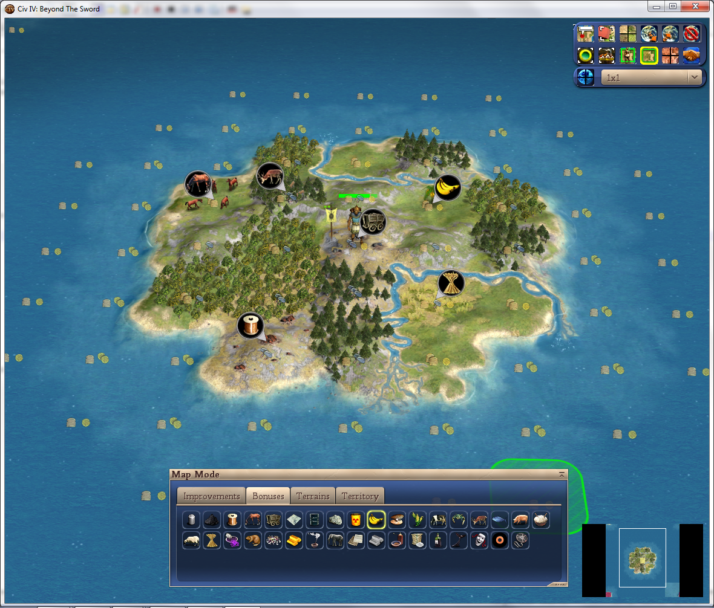
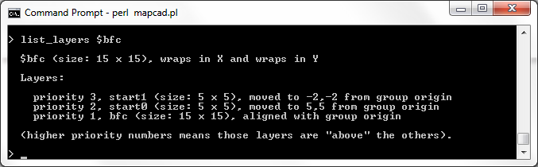
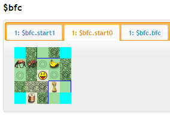
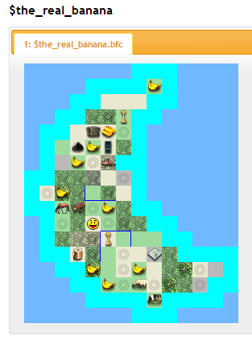
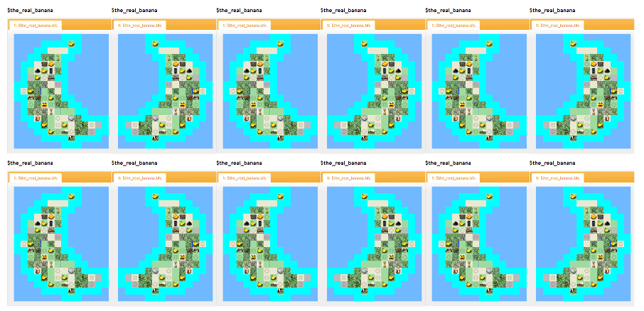
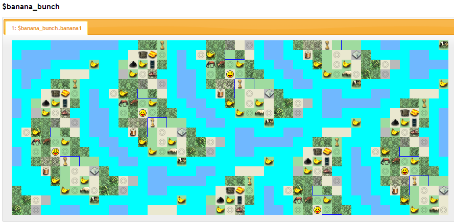

## THE RETURN TO BANANA HELL

We're back... or, should we say, we've never really left - because the banana brats have circled around you now and are still clamouring for their map. From what you can tell, they like their banana, "yay," but insist that this be a "real" game with a "real capital BFC." I mean, gimmie a break, right?

           

(We're picking up where we were at the end of the last tutorial... if you've closed your command prompt since then, you can get back to where we were by running [this script](t3/t3.civ4mc):

    run_script "tutorials/t3/t3.civ4mc"
    
We'll talk a little more about scripts later.)

## Building a Capital BFC

Making a BFC in the worldbuilder is easy enough. We'll just take one of the starting sims we generated from Tutorial 1 and edit it into something like this:

We make sure to add all modern-era resources somewhere because, like, we're *totally* sure Team Banana will stick around that long.  Then we bring it into Civ4MC, and use extract_starts to get rid of the dummy AI civ.

    import_group "tutorials/t4/bfc.CivBeyondSwordWBSave" => $bfc
    extract_starts $bfc
    dump_group $bfc
    

Start0 is the layer we want. Let's copy it into $the_real_banana and raise it above the background so its tiles will over-write the backgrounds'. Looking at the dump, coordinate 4,6 should be a good center for the BFC; however, we'll move it to 2,4 because we want its *center* to be at 4,6, and the move command will refer to its origin at the lower-left corner. b. Let's also crop away all that extra ocean in the background. Moving switftly now:

    copy_layer_from_group $bfc.start0 => $the_real_banana.bfc
    move_layer $the_real_banana.bfc 2 4
    increase_layer_priority $the_real_banana.bfc
    flatten_group $the_real_banana
    crop_group $the_real_banana 0 0 13 16

## Using scripts

Ah, now our banana is "legit" and ready to turn into a script. But, one thing first. When this is a script, our banana will re-randomize every single time the script is invoked. Instead, let's export @random_field to a table like so:

    export_mask_to_file @rand_field, "tutorials/t4/random.txt"
    
And we can build our script like this, which I've saved at [tutorials/t4/banana.civ4mc](t4/banana.civ4mc):

    # generate our banana!
    import_mask_from_ascii "tutorials/t3/circle.txt" => @circle1
    new_mask_from_shape *circle 17 17 --centerX 8 --centerY 8 --radius 7 => @circle2
    mask_difference @circle2 @circle2 --offsetX 5 -offsetY 2 => @banana_mask

    # but now lets make it random!
    import_mask_from_table "tutorials/t4/random.txt" => @rand_field
    mask_intersect @banana_mask @rand_field => @random_banana

    new_weight_table >= 0.90 => %banana,
                     >= 0.87 => %luxury,
                     >= 0.84 => %plantation,
                     >= 0.81 => %strategic,
                     >= 0.76 => %landfood,
                     >= 0.70 => coast
                     >= 0.01 => %any_land,
                     => %bananaland

    # now summon the demon!
    new_group 25 25 => $the_real_banana
    generate_layer_from_mask @random_banana %bananaland => $the_real_banana.background

    # rivet on the BFC
    import_group "tutorials/t4/bfc.CivBeyondSwordWBSave" => $bfc
    extract_starts $bfc
    copy_layer_from_group $bfc.start0 => $the_real_banana.bfc
    move_layer_to_location $the_real_banana.bfc 2 4
    increase_layer_priority $the_real_banana.bfc

    # and we're done!
    flatten_group $the_real_banana
    crop_group $the_real_banana 0 0 13 16

    return $the_real_banana
    
Only about 30 lines, including comments - not too shabby, right? Now.... to make them dance!

    fliplr $the_real_banana
    dump_group $the_real_banana
    fliplr $the_real_banana
    dump_group $the_real_banana --add_to_existing
    fliplr $the_real_banana
    dump_group $the_real_banana --add_to_existing
    fliplr $the_real_banana
    dump_group $the_real_banana --add_to_existing
    ...
    
Just kidding... you'd have to be truly B-A-N-A-N-A-S to do something like that... &#42;tugs collar&#42; 

## Putting it all together

&#42;ahem&#42;... The only real new thing here is that "return" statement at the end, which makes *run_script* produce a result. It's sort of like a function, if this were a programming language. A return statement is not needed in scripts, but it's pretty handy because it allows the run_script command to return a value. Thus, we can do this:

    run_script "tutorials/t4/banana.civ4mc" => $player1
    run_script "tutorials/t4/banana.civ4mc" => $player2
    run_script "tutorials/t4/banana.civ4mc" => $player3
    run_script "tutorials/t4/banana.civ4mc" => $player4
    run_script "tutorials/t4/banana.civ4mc" => $player5
    
We ran the script 5 times, and generated 5 bananas! That means we're in the home stretch now; we just need to combine them into one group and move them around a bit. Let's set the mood!

    
    run_script "tutorials/t4/banana.civ4mc" => $player1
    run_script "tutorials/t4/banana.civ4mc" => $player2
    run_script "tutorials/t4/banana.civ4mc" => $player3
    run_script "tutorials/t4/banana.civ4mc" => $player4
    run_script "tutorials/t4/banana.civ4mc" => $player5

    new_group 45 18 => $banana_bunch
    copy_layer_from_group $player1.bfc => $banana_bunch.banana1
    copy_layer_from_group $player2.bfc => $banana_bunch.banana2
    copy_layer_from_group $player3.bfc => $banana_bunch.banana3
    copy_layer_from_group $player4.bfc => $banana_bunch.banana4
    copy_layer_from_group $player5.bfc => $banana_bunch.banana5

    # stack banana till the morning come!
    move_layer_to_location $banana_bunch.banana2 9 4
    move_layer_to_location $banana_bunch.banana3 18 8
    move_layer_to_location $banana_bunch.banana4 27 12
    move_layer_to_location $banana_bunch.banana5 36 16

    # --rename_final_layer renames the final layer to the same as the group name, e.g. $banana_bunch.banana_bunch
    flatten_group $banana_bunch --rename_final_layer
    dump_group $banana_bunch
    export_sims $banana_bunch
    
And that's it, we're done!!!! Here's our monster, the perfect toroidal banana nightmare. I put this script at [tutorials/t4/bunch.civ4mc](t4/bunch.civ4mc), if you want to look at it.

I started by sizing the main group to 60 by 60, and spaced out the bananas 11 by 11, but then quickly realized that was way too spacey. (and way too big to post a screenshot of in this tutorial page) Because of the toroidal wrap, we could bring in everything a lot closer. Now it's the perfect size, I think - way, way too small to be acutally playable by normal people, but perfect for these goofballs, considering that they'll probably abandon the game after 40-50 turns anyways. At least this way they'll get some action! 

## Lord Almighty, we are free at last...

With great reluctance, the devil lets you go... and also, it turns out that's it for this tutorial. Hopefully, you can find your way around using the built-in help commands, which, remember, are:

    help search_string # for searching
    command_name --help # for getting a full description of the command
    
    list_layers $group
    list_shapes optional_search_string
    list_groups optional_search_string
    list_weights optional_search_string
    list_terrain optional_search_string
    
But of course, don't hesitate to ask for help if you have any trouble!

[Back to tutorial index](Readme.md)