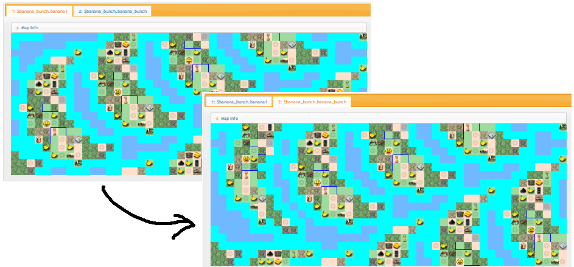
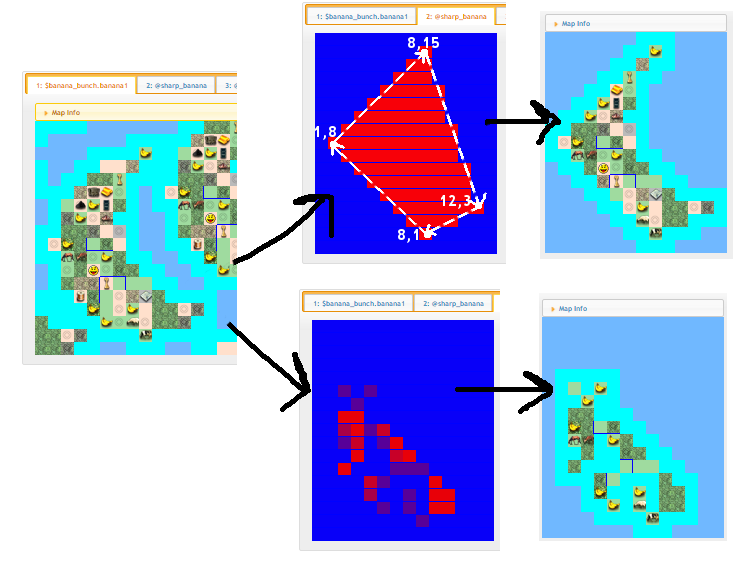

## The More You Know

Rather than a full step-by-step tutorial, this time I'll just you some examples of other useful commands and command sequences that I couldn't think of a nice contrived way to fit in to a banana-themed soap opera. But don't worry! We'll be back at it in the next tutorial! ;)

## Example 1 - Adding seafood

In the last tutorial, we added no seafood around the banana island. But, what if player 0 slipped us a fiver and asked for a few clams around his land, just before the game goes live. We can't modify the base script, so we need a way to select his landmass. The *new_mask_from_landmass* command does what we need. We give it a layer and a starting tile - 4,6 in this case - and it will select all contiguous land nearby. In addition, rather than returning the land itself, we use the "--choose_coast" option to grab the coast around the landmass rather than the land itself. From there, its a very simple matter to add the seafood.  then returns the coast *around* it rather than the land itself:
    
    new_mask_from_landmass $banana_bunch.banana1 4 6 --choose_coast => @coast 
    mask_intersect @coast @rand_field => @rand_coast
    new_weight_table >= 0.96 => coast_clam,
                     >= 0.92 => coast_crab,
                     >= 0.88 => coast_fish
                     >= 0.00 => coast
                     => %coastfood
    generate_layer_from_mask @rand_coast %coastfood => $banana_bunch.seafood
    decrease_layer_priority $banana_bunch.seafood
    flatten_group $banana_bunch --rename_final_layer
    
Alternatively, if we wanted to be "fair," we could use the *new_mask_from_water* command, starting from any coast tile, to select all contiguous coast.
    

[http://media.rhizzone.net/civ4mc/example1.html](http://media.rhizzone.net/civ4mc/example1.html)

## Example 2 - Ocean Fish

What about ocean fish? They're not on coast. Going back to the base banana, for simplicity's sake, we use the *grow_mask* command to make it happen:

    new_mask_from_landmass $the_real_banana.the_real_banana 4 6 --include_coast => @island
    grow_mask @island 1 --rescale => @island_plus1 
    mask_difference @island_plus1 @island => @island_border
    mask_intersect @island_border @rand_field => @rand_island_border

    new_weight_table >= 0.92 => ocean_fish
                     >= 0.00 => ocean
                     => %oceanfood
    generate_layer_from_mask @rand_island_border %oceanfood => $the_real_banana.oceanfish
    decrease_layer_priority $the_real_banana.oceanfish
    flatten_group $the_real_banana --rename_final_layer
    

By default, grow_mask will increase its dimensions by 1 in every direction for every tile it grows by, but we use --rescale here to prevent that because there's no ocean above and below the banana anyways. By the way, there's also a *shrink_mask* and a *grow_mask_by_bfc* commands.

[http://media.rhizzone.net/civ4mc/example2.html](http://media.rhizzone.net/civ4mc/example2.html)

## Example 3 - Messing with the land

What if you wake up one day, feeling a bit bananish, and feel like messing with one of the players, altering their island slightly? Here's a way you can extract a single island, rotate it by 10 degrees, and then plop it back down, noone else the wiser. While a bit awkward for this map, it can be helpful if you want to mess with large landforms, like those produced from a Totestra mapscript or somesuch.
    
    run_script "tutorials/t4/bunch.civ4mc" --debug_result
    
    # --include_coast selects both land AND coast, while --include_ocean_resources also grabs any resources on an ocean tile adjacent to coast (to grab all those fish and whales trolling you from the second rings of your costal cities' BFCs)
    new_mask_from_landmass $banana_bunch.banana1 4 6 --include_coast --include_ocean_resources => @island0_only
    cutout_layer_with_mask $banana_bunch.banana1 @island0_only => $banana_bunch.island0
    increase_layer_priority $banana_bunch.island0
    rotate_layer $banana_bunch.island0 -10 --autocrop
    crop_group $banana_bunch 0 0 44 17
    move_layer_by $banana_bunch.island0 -3 -3
    flatten_group $banana_bunch --rename_final_layer
    

[http://media.rhizzone.net/civ4mc/example3.html](http://media.rhizzone.net/civ4mc/example3.html)
    
## Example 4 - Other Selection Tools
    
Finally, here's two other ways to select stuff. In the first, we select tiles based on a polygon shape. In the next, we use a super version of "new_mask_from_landmass" that works kind of like the magic wand tool in photoshop to select all contiguous tiles that match a weight - in this case, all contiguous grassland tiles.
    
    # parameters are: width, height, then a list of points
    new_mask_from_polygon 14 17 "8,1" "1,8" "8,15" "12,3" "8,1" => @sharp_banana
    cutout_layer_with_mask $banana_bunch.banana1 @sharp_banana --copy_tiles => $banana_bunch.sharp

    # parameters are: layer, weight, starting point that matches the weight
    # continues to match any contiguous point 
    new_mask_from_magic_wand $the_real_banana.the_real_banana %any_grass 5 3 => @grassy_banana
    cutout_layer_with_mask $banana_bunch.banana1 @grassy_banana  --copy_tiles => $banana_bunch.grass

[http://media.rhizzone.net/civ4mc/example4.html](http://media.rhizzone.net/civ4mc/example4.html)

[Back to tutorial index](Readme.md)
