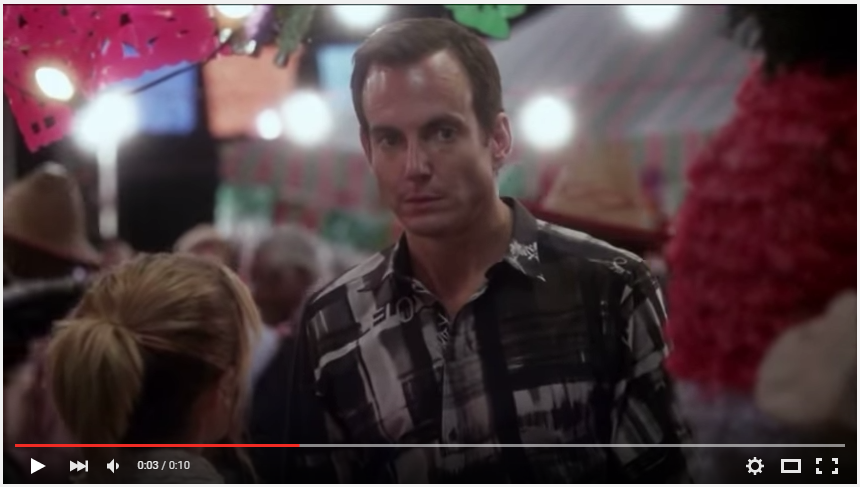

## You're beginning to feel a bit unbalanced...

Ah, what a fine Monday morning! 

"What the hell you do you mean? You sent the map out over a week ago, and the map is just terrible dude. Bananas? What the hell is up with all the bananas?"

"What are you talking about? I haven't even rolled the map yet, much less sent it out."

"Uh, have you lost your mind? We totally played a blitz last Saturday, and we're not sure if we even want to continue with this piece of crap. I mean, we already need a sub. Felipe had a huge fight with his wife on Sunday morning over it... she surprised him with what she was a nice treat, a plate of banana pancakes for breakfast in bed on his birthday, and he just couldn't help himself - he immediately just puked all over them. When he explained it was because of a "video game", she was boxing his ears all the way to the bathroom."

"Uh, wha..." time slows, and you hear a voice - is that Leonard Nimoy? - whispering over to you over the horizon... *hello darkness my old friend, i've come to"

"tMMM, nope, pretty sure I haven't even rolled it yet."

He pauses; looks you up and down, as if in disbelief. "Ok dude," he says, "I'm not sure what this weird denial is all about, but I guess you're feeling bad about the map? Uh, its not a big deal. Maybe it was some weird experimental thing? I don't know. But we'll give you one last chance. Roll and balance us a seven player Pangaea map. No funny stuff - we want some balance, sure, ok, but this damn better look and feel like any ole standard Pangaea map. And it better not have a single. goddamn. banana. Anywhere in site. So help me God..."

And with that, he marches away a huff. I wonder what that was all about?

Fast forward to a few weeks later. You've just gotten an irate phone call from Bill, something about how "we've been waiting for their starting screenshots for two weeks now, and so when is the map going to be ready?" Blah blah blah, whatever. 

You boot up Civ4, and you roll the stupid Pangaea map. Open worldbuilder -> "Save Worldbuilder file."

God, this thing looks like a mess. Huge swathes of ice, tundra, and desert, enormous foodless regions, massive unbalanced capitals, some players boxed in and others with huge amounts of land to settle. Well, pretty typical stuff, really. At the same time, with the game still up, you've loaded up Civ4MC in another window, and you import the map:

    import_group "tutorials/t6/original.CivBeyondSwordWBSave" => $tutorial6
    
and then run the balance tool!
    
    balance_report $tutorial6
    
It spits out a bunch of stuff:

So, that's it, right? You're all done, map is balanced? NO! 

## Balancing a map

The tool doesn't the balance the map at all! I once thought an automatic-balancer tool was a good idea, but eventually realized that there's so many different aspects to balance and different ways the map could play out that the task is essentially impossible to automate except on very specific, very-mirrored maps. Only a human judgement can suffice here. So, instead, *balance_report* simply tells you things about the map that help *you*, the mapmaker, determine whether or not your map is balanced! Things like:

* Based on the land, which tiles will each player likely obtain without getting embroiled in war? What will the layout of the map look like?
* How many neighbors does each player have, and how tense will their borders be?
* Does each player have equal access to strategic resources? What about luxuries? Resources placed near borders may not necessarily go towards the player they were "supposed" to go to!

"But Joey," you ask. "How can we know all this stuff if the game hasn't actually been played yet?" Good question! We guess!

*record-scratch*

No, I'm serious! We guess! We just try to guess really well. What we do is create a bunch of mini-AI bots and then have them settle the land according to how a human player might try to do it. If the land is really high quality, with lots of food, these bots will claim a lot of it; likewise, if the land is poor, they won't gain as much. We take note of what they settled, and then reset the map and make them do it again. We introduce a little bit of randomness into the algorithm, so that instead of always settling the "best" spot everytime, sometimes they'll settle the 2nd best site instead, so that we can also think about what will happen if players don't settle the way we expect. Once the second run is done, we... reset and do it again! And again. And then... we reset and make them do it again, and again and again and again! Hundreds of times! The more we iterations we do this, the more accurate our guess will be. 

Let's take a look at how the tool guessed our map would play out:

[http://media.rhizzone.net/civ4mc/t6/tutorial6_orig.html](http://media.rhizzone.net/civ4mc/t6/tutorial6_orig.html)

Well, it looks pretty bad. Players 4 and 5 are squashed with almost no land, and Player 3 has way too much. Players 0, 1, and 2 should probably have a bit more/better land than the others, but really only player 2 looks ok. Why is this? A look at the food resource distrubtion is enlightening:

