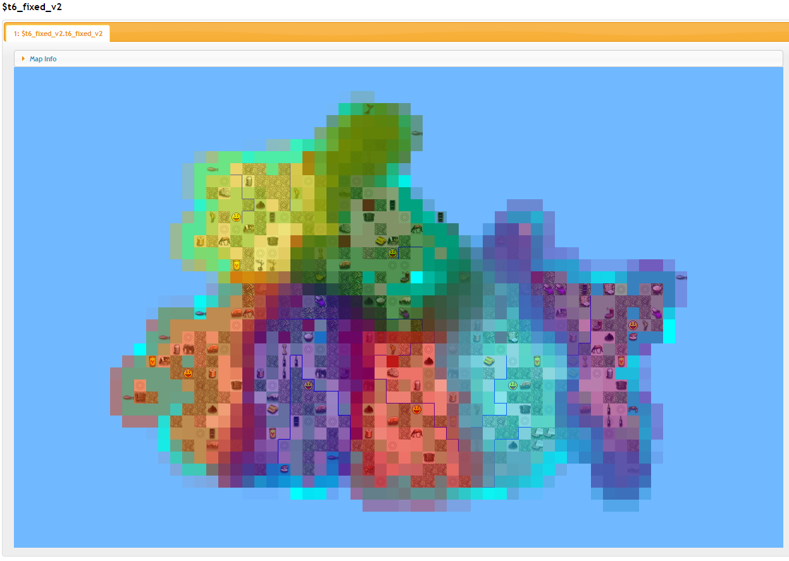

## You're beginning to feel a bit unbalanced...

Ah, what a fine Monday morning! The sun is shining, the birds are chirping. Of in the distance, you see your good friend, Bill, a fellow Civ4 afficiando, walking toward you. You wave hello. "Mornin', Bill! Excited for the new game to start?"

Bill slows to a halt. Instead of returning your wave, you see his face scrunge up for a stuttred moment in what you can only understand as bewildered disgust.

"Uh... what the hell you do you mean, dude? You sent the map out over a week ago, and the map is just terrible, absolutely terrible dude. We can't understand why you're messing with us so bad. Bananas? What the hell is with the bananas?"

You're taken aback... "Huh? What are you talking about? I haven't even rolled the map yet, much less sent it out. You just asked me to make it on Friday."

"Uh, right, have you lost your mind? I asked for it Friday and you sent it out on Friday night at like 5am. We played through a blitz the next evening, excited to get started, and already we're not sure if we even want to continue with this disasterpiece. I mean, we already need a sub. Felipe had a huge fight with his wife on Sunday morning over it... she surprised him with what she was a nice treat, a plate of banana pancakes for breakfast in bed on his birthday, and he just couldn't help himself - he involuntarily puked all over them the moment they were under his nose. When he tried to explain it was because of a "video game", his wief was boxing his ears all the way to the bathroom."

"Uh, wha..."

"It was all the bananas on your damn map, dude! What's with the damn bananas!??!"

"I don't know what you're talking about, I didn't do anything with banan-"

"STOP!!! THEY WERE TOTALLY FREAKING EVERYWHERE!!!!"

Time slows, and... in the distance...? you hear a voice whispering over to you, perhaps from over the horizon... i-is that Leonard Nimoy?  <i>hello darkness my old friend...</i> he says. <i>i've come to talk to you ag-</i>

"-tMMM, nope, pretty sure I haven't rolled it yet."

Bill tenses. He looks nervous for some reason. What's his problem? "Uh...... um, ok man," he says, "I'm not sure what your deal is, or this weird denial is all about, but I guess you're feeling bad about the map? Uh, its not a big deal. Maybe it was some weird experimental thing? I don't know. But let's try again. Roll and balance us, uh, a seven player Pangaea map. No funny stuff - we want some balance, sure, ok, but this  better look and feel like any ole standard Pangaea map. And it better not have a single. god. damn. banana. Anywhere in sight. So help me God dude..."

And with that, he marches away a huff, nervously glancing over his shoulder until he clears the corner some yards away. I wonder what that was all about?

So, you boot up Civ4, and you roll the stupid Pangaea map. Damn fascists, stifling your creativity. Blegh.

God, this thing looks like a real mess. Huge swathes of ice, tundra, and desert, enormous foodless regions, massive unbalanced capitals, some players boxed in and others with huge amounts of land to settle. It's not very easy to balance either; tight tiles-per-player and long, contested borders make it very hard to predict whose land is whose.

Well, pretty typical stuff, really.  Open worldbuilder -> "Save Worldbuilder file." At the same time, with the WB still up, you load up Civ4MC in another window, and you import the map:

    import_group "tutorials/t6/t6.CivBeyondSwordWBSave" => $t6
    
and then run the balance tool!
    
    balance_report $t6
    
The program churns for awhile (don't be alarmed with it being slow), and then finally procedes to spit out a bunch of stuff:

So, that's it, right? You're all done, map is balanced? NO! You wish! 

## Balancing a map

That's right, this tool doesn't the balance a map at all! I once thought an automatic-balancer tool was a good idea, but eventually realized that there's so many different strategic aspects to balance and different ways the map could play out that the task is essentially impossible to automate except on very specific, very-mirrored maps. For example, simply balancing out tiles per player and resources isn't fair if one player has just one neighbor, through a chokepoint, and another has 4 long, contested borders. It's also very difficult to judge how players will actually settle. If someone's scout gets eaten by a bear on T10, they might not see that good site they were supposed to get for their second city until much later, and so then they might not get the second-ring city beyond it that had what was supposed to be their iron and ivory.

Thus, only a human judgement can truly judge here. Instead, the *balance_report* command simply tells you things about the map that help *you*, the mapmaker, determine whether or not your map is balanced! Things like:

* Based on the land, which tiles will each player likely obtain before getting embroiled in war? What will the layout of the map look like?
* How many neighbors does each player have, and how tense will their borders be?
* Does each player have equal access to strategic resources? What about luxuries? What is the likelihood that they'll screw themselves with a bad dotamap? Remember, resources placed near borders may not necessarily go towards the player they were "supposed" to go to!

And, its important, I think, to take this stuff in consideration. Remember that these games last a very long time - anywhere from 7-8 months to over a year for a full game - and that we can't just go back to main menu and roll a new game, as if this were a single player session, if we're annoyed with this one. The only thing that keeps these games going is the duty and honor of all players involved, and so it is a terrible and very demotivating feeling to discover that a game was essentially lost on T0 simply due to the map after you've already spent many, many hours on a pitboss game, because all you've got to look forward to is many more months of misery. Suddenly, what was originally a fun competition becomes an unhappy chore. While some players can deal with this situation, many others will simply stop reporting... and then stop trying... and then semi-disappear... until finally the game needs a pause every other day, and may even go on permanent hiatus. What was one player's problem turns out to ruin the game for everybody. Others players, like myself (XD), will try harder, attempting to struggle against the impossible while getting increasingly more stressed and angry, until they finally start lashing out like a huge asshole. (see myself, RBPB25 ;p). And again, this can have a terrible effect on the game that other people may have been enjoying. Of course, players can abandon the game for other reasons, such as playing badly and losing a war, i.e. "IRL Issues", or even for legitimate IRL issues, but in general it seems to be easier to find a sub to provide hospice care for a dying civ for a couple weeks, for the former case, or to take over completely for a healthy civ, for the later, than it is to find someone willing to deal with managing a crummy civ for a long time. And besides, while there's nothing as a mapmaker you can do about those latter two cases, you can at least try to balance the map out so that the game feels fair from the beginning. And, of course, you can try to figure out this stuff by hand, although it can be a very mind-numbing and mistaken-prone process.

"But Joey," you ask. "That's all well and good, but how can we know who gets how much of what, when, and how if the game hasn't actually been played yet?" Good question! The answer: We guess!

*record-scratch*

No, I'm serious! We guess! We just try to guess really well. What we do is create a bunch of mini-AI bots and then have them settle the land according to how a human player might try to do it. If the land is really high quality, with lots of food, these bots will claim a lot of it; likewise, if the land is poor, they won't gain as much. We take note of what they settled, and then reset the map and make them do it again. We introduce a little bit of randomness into the algorithm, so that instead of always settling the "best" spot everytime, sometimes they'll settle the 2nd best site instead, so that we can also think about what will happen if players don't settle the way we expect. Once the second run is done, we... reset and do it again! And again. And then... we reset and make them do it again, and again and again and again! Hundreds of times! The more we iterations we do this, the more accurate our guess will be. 

Let's take a look at how the tool guessed our map would play out, based on the default settings of 100 iterations simulated out to turn 155. It can be useful to look at the status of the map on earlier turns too (e.g. turn 80 or T115), but for now lets just keep it simple.

[http://media.rhizzone.net/civ4mc/t6.html](http://media.rhizzone.net/civ4mc/t6.html)

Well, things looks pretty bad. First of all, the custom game roller has totally trolled us on player colors; gotta fix those first. Next, Players 4 and 5 are squashed with almost no land, and Player 3 has way too much. Player 3, starting in the top corner behind some desert, also has very little neighbor tension. Players 0, 1, and 2 should probably have a bit more/better land than the others, considering they're in the middle of it all, but really only player 2 looks ok. However, their spacing doesn't look too bad. So what's the deal here? A look at the food resource distrubtion is enlightening:

Indeed, players 0, 1, and 4 have almost no food! Player 0 and 1 are also a bit land-poor because much of their supposed-land is ice and tundra, which the balance reporter doesn't actually count. We should delete that. Player 6 isn't so great either. Player 4's capital in particular is terrible, with only a plains cow as "food." We'll need to give them a bit more to work with. The balance report tells us this explicitly:

    For Player 0 (GermanJoey):
        Expected number of strong/weak food resources:  1.74 /  1.60
        Overall tile score and contention: 110.70 / 0.354
    For Player 1 (TXT_KEY_LEADER_CHURCHILL):
        Expected number of strong/weak food resources:  1.65 /  1.72
        Overall tile score and contention: 118.70 / 0.344
    For Player 2 (TXT_KEY_LEADER_ALEXANDER):
        Expected number of strong/weak food resources:  4.21 /  0.17
        Overall tile score and contention: 116.64 / 0.452
    For Player 3 (TXT_KEY_LEADER_RAMESSES):
        Expected number of strong/weak food resources:  6.12 /  1.91
        Overall tile score and contention: 142.36 / 0.601
    For Player 4 (TXT_KEY_LEADER_ASOKA):
        Expected number of strong/weak food resources:  2.31 /  2.21
        Overall tile score and contention:  74.23 / 0.382
    For Player 5 (TXT_KEY_LEADER_STALIN):
        Overall tile score and contention:  83.54 / 0.349
        Expected number of strong/weak food resources:  3.77 /  3.04
    For Player 6 (TXT_KEY_LEADER_KUBLAI_KHAN):
        Overall tile score and contention:  95.67 / 0.507
        Expected number of strong/weak food resources:  2.77 /  2.95
        
If, for example, a player gets a particular tile in 80% of simulation iterations, then we count that as 0.8 tiles for that player and 0.2 tiles for the other. Likewise, if that tile is a corn, then we count that as 0.8 food for the one player, and 0.2 food for the other.  Based on this, it looks like Player 3, Ramses, gets twice the land and 3x the food resources as his neighbor Asoka! Yikes! Considering their situation on the map, they should actually be about equal. In addition to the overlay view, the balance algorithm also generates a heatmap of the raw BFC-value per tile, which is a relative measure of "how good would a city planted on this tile be if we only consider the yields of the tiles?" and takes into consideration things like number of trees, number of rivers, available food, food in the first ring, number of bad tiles and number of very good tiles (using SevenSpirits' tile value system), etc. Later on, the algorithm will adjust this for strategic concerns, such has how far a city is from the capital, whether we have copper yet, etc. In this case, the bfc value heatmap looks very, very blue, indicating that the land quality is very poor overall:

[http://media.rhizzone.net/civ4mc/t6.bfc_value.html](http://media.rhizzone.net/civ4mc/t6.bfc_value.html)

While this doesn't necessarily indicate a problem by itself (although I personally feel that lusher maps are more interesting because they offer players more choices), it is more difficult to balance a sparser map because small differences in land quality end up having a much bigger effect on how fast players snowball relative to each other. The difference between whether somehow has a pig in their second city while someone else has a plains sheep becomes huge when each player has only 2 food resources a piece in their whole empire!

The balance report tells us other things too and can generate dozens of different kinds of heatmaps, but the first thing we need to do is get the land balance right, which means we're only looking at total land, total food, total contention (lower numbers mean higher contention), and neighbor distance for now. Basically, the overall, macro-level layout of the map. After that, we can fix other things, like resource balance.

So, for our next pass, we'll do this, and see how it turns out:

    import_group "tutorials/t6/tutorial6_orig.CivBeyondSwordWBSave" => $t6

    # make colors stand out more
    set_player_data $t6 0 --color "Dark Blue"
    set_player_data $t6 6 --color "Dark Purple"

    # straight up delete every ice tile on the map
    new_mask_from_filtered_tiles $t6.tutorial6_orig %any_snow => @snows
    delete_from_layer_with_mask $t6.tutorial6_orig @snows 

    # upgrade about 40% of the tundra/desert to plains/grass
    new_weight_table >= 1.00 => tundra,
                     >= 1.00 => desert
                     => %select_bad
                     
    new_weight_table >= 0.90 => grass,
                     >= 0.60 => plains
                     => %upgrade
                     
    new_mask_from_filtered_tiles $t6.tutorial6_orig %select_bad => @bad
    new_mask_from_shape *random 64 40 => @rand_field
    mask_intersect @bad @rand_field => @rand_bad
    modify_layer_with_mask $t6.tutorial6_orig @rand_bad %upgrade --check_type

    # move start 4 a bit
    extract_starts $t6
    move_layer_by $t6.start4 -2 2
    
[tutorials/t6/fixup.civ4mc](t6/fixup.civ4mc)

I also add some food in the map editor. (duplicated in the script) I then rerun the report, and get something like this:

[http://media.rhizzone.net/civ4mc/t6_fixed.html](http://media.rhizzone.net/civ4mc/t6_fixed.html)

    For Player 0 (GermanJoey):
        Expected number of strong/weak food resources:  3.42 /  1.15
        Overall tile score and contention: 112.31 / 0.388
    For Player 1 (TXT_KEY_LEADER_CHURCHILL):
        Expected number of strong/weak food resources:  3.68 /  0.99
        Overall tile score and contention: 123.31 / 0.367
    For Player 2 (TXT_KEY_LEADER_ALEXANDER):
        Expected number of strong/weak food resources:  4.47 /  0.30
        Overall tile score and contention: 117.18 / 0.442
    For Player 3 (TXT_KEY_LEADER_RAMESSES):
        Expected number of strong/weak food resources:  4.42 /  0.36
        Overall tile score and contention:  84.81 / 0.502
    For Player 4 (TXT_KEY_LEADER_ASOKA):
        Expected number of strong/weak food resources:  4.66 /  4.16
        Overall tile score and contention: 127.14 / 0.527
    For Player 5 (TXT_KEY_LEADER_STALIN):
        Expected number of strong/weak food resources:  5.41 /  3.12
        Overall tile score and contention:  87.49 / 0.297
    For Player 6 (TXT_KEY_LEADER_KUBLAI_KHAN):
        Expected number of strong/weak food resources:  3.86 /  3.82
        Overall tile score and contention: 105.47 / 0.574

It's looking a bit better, but now Asoka's getting a bit too big for his britches - he totally overtakes Rameses. It looks like the problem is because Ramses has very little food to his NE, and therefore does not end up contesting the area past it. An additional food or two will improve the situation, I think. Unfortunately, Player 5, Stalin, is still squashed, and because Players 0, 1, and 2's situations are actually about what we want, it looks like our only choice will be to add a bit more land to Stalin's east. We don't want to contort the land too much though, so let's also give him his own island as a safe-backfill zone, since otherwise we'd have to add a *lot* of land tiles to fix his situation. We then run one more time:

[http://media.rhizzone.net/civ4mc/t6_fixed_v2.html](http://media.rhizzone.net/civ4mc/t6_fixed_v2.html)
        
    For Player 0 (GermanJoey):
        Expected number of strong/weak food resources:  5.57 /  1.24
        Overall tile score and contention: 122.15 / 0.404
    For Player 1 (TXT_KEY_LEADER_CHURCHILL):
        Expected number of strong/weak food resources:  3.43 /  1.18
        Overall tile score and contention: 117.08 / 0.324
    For Player 2 (TXT_KEY_LEADER_ALEXANDER):
        Expected number of strong/weak food resources:  4.59 /  0.79
        Overall tile score and contention: 120.53 / 0.461
    For Player 3 (TXT_KEY_LEADER_RAMESSES):
        Expected number of strong/weak food resources:  4.70 /  0.45
        Overall tile score and contention:  96.06 / 0.530
    For Player 4 (TXT_KEY_LEADER_ASOKA):
        Expected number of strong/weak food resources:  3.92 /  3.78
        Overall tile score and contention: 112.81 / 0.526
    For Player 5 (TXT_KEY_LEADER_STALIN):
        Expected number of strong/weak food resources:  5.65 /  1.05
        Overall tile score and contention:  95.94 / 0.517.
    For Player 6 (TXT_KEY_LEADER_KUBLAI_KHAN):
        Expected number of strong/weak food resources:  4.16 /  4.38
        Overall tile score and contention: 103.14 / 0.548

Much better! Not perfect but... eh, close enough for now. They want a pangaea map so they're gonna expect a bit of imbalance.

Now, lets look at the rest of the file. The other two main things the balance checker checks is luxuries and strategic resources. For luxuries, it counts how much each player gets and then calculates a score based on how much unique and tradebable luxuries you have for each era; ancient luxues are worth more for this score, of course. Here, players 1 and 3 have very poor luxury access, while player 0 has great luxury access. So, lets move some of 0's luxuries closer to 0.

    For Player 0 (GermanJoey):
      Relative lux score: 1.000
        5.156 luxuries obtained, of which 1.955 are ancient and 3.20 are classical.
            ancient ivory (96% likehood of access; 1.325 instances obtained; owned by 46.571% of all players)
            ancient gold (99% likehood of access; 0.995 instances obtained; owned by 51.571% of all players)
            classical silk (20% likehood of access; 0.205 instances obtained; owned by 29.119% of all players)
            classical gems (41% likehood of access; 0.768 instances obtained; owned by 15.881% of all players)
            classical dye (80% likehood of access; 0.808 instances obtained; owned by 41.976% of all players)
            classical spices (77% likehood of access; 0.770 instances obtained; owned by 46.643% of all players)
            classical wine (100% likehood of access; 2.955 instances obtained; owned by 29.857% of all players)
            
    For Player 1 (TXT_KEY_LEADER_CHURCHILL):
      Relative lux score: 0.125
        1.153 luxuries obtained, of which 0.625 are ancient and 0.528 are classical.
            ancient ivory (62% likehood of access; 0.990 instances obtained; owned by 46.571% of all players)
            classical gems (18% likehood of access; 0.303 instances obtained; owned by 15.881% of all players)
            classical spices (34% likehood of access; 0.570 instances obtained; owned by 46.643% of all players)
            
    For Player 3 (TXT_KEY_LEADER_RAMESSES):
      Relative lux score: 0.225
        1.355 luxuries obtained, of which 0.32 are ancient and 1.035 are classical.
            ancient whale (32% likehood of access; 0.320 instances obtained; owned by 9.571% of all players)
            classical incense (92% likehood of access; 1.770 instances obtained; owned by 15.429% of all players)
            classical silk (10% likehood of access; 0.110 instances obtained; owned by 29.119% of all players)
            
Likewise, the reporter also checks strategic resources. For the most part, it simply goes down a checklist for each resource, but it also checks the "quality" of the player's copper and horse. If a player has to settle a foodless site for their strategic resources, they'll end up gimping themselves. In this case, player 2 and 3 have very poor access to their horse and copper because there's no freaking food nearby. We should move them a bit closer to a food source.

For Player 3 (TXT_KEY_LEADER_RAMESSES):
    Strategic access:
        - Horse was found at a distance of 2 from capital; its best site at 18,24 has it in the
          first ring, with a relative strategic quality score of 0.112
        - Copper was found at a distance of 3 from capital; its best site at 17,24 has it in the
          second ring, with a relative strategic quality score of 0.046

For Player 4 (TXT_KEY_LEADER_ASOKA):
    Strategic access:
        - Horse was found at a distance of 2 from capital; its best site at 18,24 has it in the
          first ring, with a relative strategic quality score of 0.112
        - Copper was found at a distance of 3 from capital; its best site at 17,24 has it in the
          second ring, with a relative strategic quality score of 0.046

And, so on, and so on. We can keep iterating and improving as much as we want to. However, always remember that **YOUR** judgement is what's important here. *balance_report* is only here to help you get a better feeling for the map and to count stuff up so that you don't have to squint at the map for hours counting stuff on your fingers. And, finally, remember not to overtune your map to the numbers too much, especially since there will be some small variation in the results from run to run due to the randomness of the algorithm. Obsessively trying to get numbers to land where you want them is not only very tedious, but can lead you to lose sight of the big pictures issues.
        
[Back to tutorial index](Readme.md)